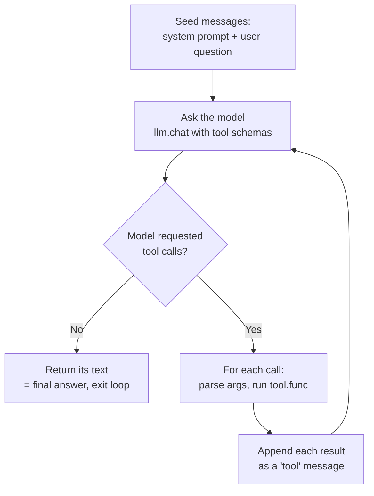
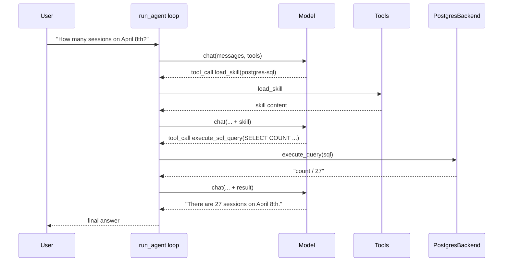

# Architecture & Debugging Guide

A code map for the **standalone** build (`src/agentic_search/` + `scripts/`): a plain
Python agent loop that lets a model call tools over a PostgreSQL + pgvector backend —
no LangChain, no framework magic. Every step is yours to set a breakpoint on.

> The original LangChain + Elasticsearch notebooks still live under `notebooks/`; this
> document describes the standalone reimplementation.

## Two ideas hold the whole thing up

Understand these two and the rest is wiring you can skim:

1. **The loop** (`agent.py`). An agent is just: ask the model, run whatever tools it
   asked for, hand the results back, repeat — until it answers without asking for a
   tool. That's the entire control flow, ~60 lines.
2. **The seam** (`datasource/base.py`). The tools talk to a `SearchBackend`
   *interface*, never to Postgres directly. Swap the backend and the loop, tools, and
   prompts don't change. This is what makes changing the datasource cheap.

Data flows one direction:

```
scripts/  ──►  build.py  ──►  run_agent  ──►  tools  ──►  SearchBackend
(entry)       (assemble)      (the loop)      (call)      (Postgres/pgvector)
```

Everything else — `config`, `prompts`, `embeddings`, `dataset` — is support.

## The agent loop (the core)

`run_agent(llm, system_prompt, tools, query)` in `agent.py` is the heart of the
project. Read this file first.



- The loop is bounded by `max_steps` (a runaway guard).
- `verbose=True` prints every turn — that's the trace shown below.
- A **tool is just a dataclass**: a `name`, a `description`, a JSON-schema for its
  arguments, and a Python `func`. `Tool.to_openai_schema()` is what the model sees.

**Read-first files:** `src/agentic_search/agent.py` (the `Tool` dataclass and
`run_agent`), then `models.py` (`Document`, `Skill`). ~150 lines gives you the whole
picture.

### How the loop knows when to stop

There are exactly two ways out — and the primary one is *not* an explicit "done" signal.

**Exit 1 — the model stops asking for tools** (`agent.py:95-97`). Every turn, `run_agent`
checks whether the model's response contained any tool calls:

```python
tool_calls = message.get("tool_calls")
if not tool_calls:
    return message.get("content") or ""   # this response *is* the final answer
```

There is no "stop" tool and no sentinel token — **stopping is the *absence* of a tool
request.** The model may call a tool or just reply (the request uses
`tool_choice="auto"`, so it's never forced to), and the first turn it replies without a
tool call, the loop returns that text. Equivalently, the chat-completions `finish_reason`
flips from `"tool_calls"` to `"stop"`; we infer the same thing from the missing
`tool_calls` rather than reading `finish_reason` directly.

**Exit 2 — the step cap** (`agent.py:88` and `agent.py:126`). If the model never settles
and keeps requesting tools, the `for _ in range(max_steps)` loop (default 10) runs out and
returns `"(stopped: reached max steps without a final answer)"`. This is purely a runaway
guard — in a healthy run, Exit 1 always fires first.

Two things that trip people up:

- **A "step" is one model turn, not one tool call.** A single turn can request several
  tools (`for call in tool_calls`); they all run and append results before the next model
  call. `max_steps` counts round-trips, not tool executions.
- **The check runs right after the model speaks, before any tool executes.** Tool errors
  don't stop the loop — they're caught and fed *back* to the model as the tool result, so
  it can self-correct on the next turn.

## A request, end to end

Technique 02 answering *"How many sessions are on April 8th?"* — the shape of what
`run_agent` prints:

```text
=== User ===
How many sessions are on April 8th?

--- Tool call: load_skill ---
    args: {"skill_name": "postgres-sql"}

--- Tool result: load_skill ---
Loaded skill: postgres-sql        # ILIKE, single quotes, COUNT(*) ...

--- Tool call: execute_sql_query ---
    args: {"query": "SELECT COUNT(*) AS count FROM conference_schedule WHERE day = 'April 8'"}

--- Tool result: execute_sql_query ---
count
27

=== Assistant ===
There are 27 sessions on April 8th.
```



Every line maps to code:

- `build_db_query(backend)` in `build.py` assembled the system prompt (with the skill
  advertised) and the two tools — `execute_sql_query` and `load_skill`.
- **Progressive disclosure**: only the skill's one-line description was in the prompt.
  The model pulled the full `postgres-sql` guidance on demand via `load_skill`
  (`skills.py`) before writing SQL.
- `execute_sql_query` → `PostgresBackend.execute_query` ran the SQL in a **read-only**
  transaction and returned CSV.
- The model read `27` and answered — no more tool calls, so the loop exits.

## Module map

### Entry points (`scripts/`)

| File | Role | Key flags |
|---|---|---|
| `prepare_data.py` | Index sessions into Postgres + export files | `--no-embeddings`, `--no-export` |
| `run_vanilla_search.py` | Technique 01 runner | `-q` |
| `run_db_query.py` | Technique 02 runner | `-q`, `--no-skill` |
| `run_shell_search.py` | Technique 03 runner | `-q`, `--jina` |

### Assembly

| File | Role | Key symbols |
|---|---|---|
| `build.py` | Turns a backend into `(system_prompt, tools)` per technique | `build_vanilla_search`, `build_db_query`, `build_shell_search` |
| `tools.py` | The three tools, as `Tool` objects closing over the backend | `make_semantic_search_tool`, `make_query_tool`, `make_shell_tool` |
| `skills.py` | Progressive-disclosure skills (no middleware) | `make_load_skill_tool`, `skills_addendum`, `load_skill` |
| `prompts.py` | Load system prompts from `prompts/` | `load_prompt`, `load_fs_prompt` |

### Agent core

| File | Role | Key symbols |
|---|---|---|
| `agent.py` | The loop and the tool abstraction | `Tool`, `run_agent` |
| `llm.py` | OpenAI-compatible chat over `requests` | `LLMClient.chat`, `build_llm` |

### Data layer — the swappable seam

| File | Role | Key symbols |
|---|---|---|
| `datasource/base.py` | The `SearchBackend` interface everything depends on | `index_documents`, `semantic_search`, `execute_query`, `query_skill` |
| `datasource/postgres_backend.py` | Reference backend: SQL + pgvector `<=>` | `PostgresBackend` (`psycopg`) |
| `datasource/filesystem.py` | Export one `.txt` per session (technique 03) | `export_records_by_type` |
| **`dataset.py`** | **Rewrite this for new data.** Record → Document / markdown | `load_records`, `record_to_document`, `record_to_markdown` |
| `embeddings.py` | Jina embeddings + cosine similarity | `JinaEmbedder`, `cosine_similarity` |

### Support

| File | Role | Key symbols |
|---|---|---|
| `config.py` | Settings from `.env`; resolves paths from the repo root | `load_settings`, `Settings` |
| `models.py` | Shared types | `Document`, `Skill` |

## The three techniques

All three run through the **identical** `run_agent` loop. The only difference is which
tool(s) the model gets and which system prompt describes the data.

| | 01 · Vanilla | 02 · DB query | 03 · Shell |
|---|---|---|---|
| **Tool** | `semantic_search_conference_sessions` | `execute_sql_query` + `load_skill` | `terminal` (subprocess) |
| **Backend method** | `semantic_search()` → pgvector `<=>` | `execute_query()` → read-only SQL | files under `data/session_data/` |
| **Wins at** | concept / topic questions | exact matches, counts, filters (heuristic) | `grep` keywords, `jina-grep` for meaning |
| **Fails at** | exact terms it never embedded (e.g. "GEPA") | wrong SQL dialect without the skill (`LIKE` vs `ILIKE`) | runs arbitrary commands — no sandbox |

> ⚠️ The shell tool executes whatever the model types. Only run technique 03 in an
> environment you're comfortable giving an LLM shell access to.

## Debugging in VS Code

Open the repo, pick a config in **Run and Debug**, press **F5**. `.vscode/launch.json`
ships one config per technique; it sets `PYTHONPATH=src` and `justMyCode: false`, so you
can step into `psycopg` and `requests` too. No `pip install -e .` required — the scripts
add `src/` to the path themselves.

Breakpoints that teach you the most:

| Where | What to inspect |
|---|---|
| `agent.py` · `run_agent` — the `message = llm.chat(...)` line | Watch `messages` grow each turn; inspect `message["tool_calls"]` to see what the model decided. |
| `agent.py` · `run_agent` — the `for call in tool_calls` loop | Step over `args = json.loads(...)` and into `tool.func(**args)` — the boundary from "model output" to "your code running". |
| `postgres_backend.py` · `execute_query` / `semantic_search` | See the exact SQL the model wrote, or the pgvector `<=>` query. Errors here are *returned as strings*, not raised — that's how the model self-corrects. |

**Debug Console tricks:** paused in `run_agent`, evaluate `messages[-1]` to see the last
turn, or `[t.name for t in tools]` to confirm what the agent was given. Run technique 02
with `--no-skill` to watch it stumble on the SQL dialect, then without the flag to watch
the skill fix it.

## A learning path, in order

1. **Read `agent.py` + `models.py`** — the loop and the two data types. Don't move on
   until the loop feels obvious.
2. **Run `prepare_data.py --no-embeddings`** — then `psql` into the table and browse
   `data/session_data/`. Now you know what the agent is searching.
3. **Debug `run_db_query.py` with a breakpoint in `run_agent`** — step through one full
   round trip: model → tool → result → answer. This is the "aha".
4. **Re-run with `--no-skill`, then without it** — feel what Agent Skills / progressive
   disclosure actually buys you.
5. **Open `datasource/base.py`, then `postgres_backend.py`** — the interface, then one
   concrete implementation of it. This is the seam.
6. **Compare the three `build_*` functions** — one loop, three tool sets. That contrast
   is the whole workshop.

## Swapping the datasource

Because the loop and tools depend only on the `SearchBackend` interface, changing the
data is a small, contained job — three touch points:

- **New data** → rewrite `dataset.py` (`load_records`, `record_to_document`,
  `record_to_markdown`) so your records become `Document`s.
- **New schema** → update the table/column description in
  `prompts/system_prompt_db.md`, and the SQL skill in `PostgresBackend.query_skill()`.
- **New store** (optional) → subclass `SearchBackend` and implement the four methods.
  Nothing in `tools.py`, `agent.py`, or `build.py` changes.

It's already Postgres SQL, so heuristic queries work through `execute_query` today —
index with `--no-embeddings` and lean on SQL until you decide what's worth embedding for
vector search. pgvector is wired and waiting.
